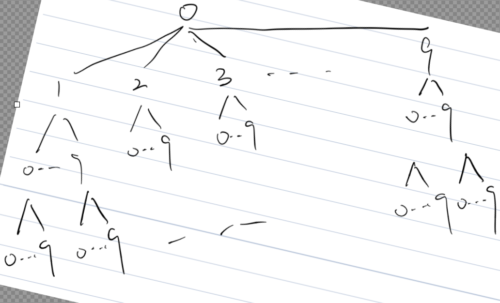

### Q：

Given an integer `n`, return all the numbers in the range `[1, n]` sorted in lexicographical order.

You must write an algorithm that runs in `O(n)` time and uses `O(1)` extra space. 

<!-- more -->

### S：

First: the dictionary order can be abstracted as a tree, as shown in the following figure



So, there is a small to large output is actually the output of his prior traversal

**Reference to the prior-order traversal of the binary search tree write **

1. Recursion:

The difference here is the need to round off the head node 0, to 1-9 respectively as the root node for traversal output: 1:

1. recursion end condition, the current node > n, the recursion ends

2. add the element value into res, traverse its 10 sibling nodes, enter the recursion of its child nodes

````java
class Solution {
    public List<Integer> lexicalOrder(int n) {
        List<Integer> list = new ArrayList<>();
        for (int i = 1; i < 10; i++){
             dfs(n, i, list);
        }
        return list;
    }
    private void dfs(int n,int i,List<Integer>list){
        if(i>n){
            return ;
        }
        list.add(i);
        for(int j=0;j<=9;j++){
            dfs(n,i*10+j,list);
        }
    }

}
```
````


​    2.迭代:

\2. Iteration .

**tipp **: `while(curr%10==0) curr/=10;` The purpose of this line of code is to handle numbers that should end early in the dictionary order.

For example, suppose `n` is 130. When we traverse through the dictionary order, it should be in this order: 1, 10, 11, ... , 19, 2, 20, ... , 19, 2, 20, ... , 29, ... , 13, 130, 14, ... , 19, 2, ... , 9.

After our `curr` becomes 130, if we directly `curr+=1`, then `curr` becomes 131, which is obviously more than `n` and does not fit the dictionary order. We should skip all 13x (x > 0) numbers and just become 14.

This is the purpose of the line `while(curr%10==0) curr/=10;`: 

when the last digit of `curr` is 0 (i.e. `curr%10==0`), we should fall back to the previous level (i.e. `curr/=10`). In this example, 130 falls back to 13, and then `curr+=1` becomes 14, so that it is in dictionary order.

This treatment ensures that our traversal order is always in dictionary order, i.e., we traverse 

       ```java
       class Solution {
            public List<Integer> lexicalOrder(int n) {
                List<Integer> list = new ArrayList<>();
                int curr = 1;
                // 遍历/traverse
                for(int i=0;i<n;i++){
                    list.add(curr);
                    if(curr*10<=n){
                        curr*=10;//遍历下一层/find next level number
                    }else{
                        if(curr>=n)   curr/=10;//如果比n大，结束遍历退回上一层/If greater than n, end traversal and return to previous level
                        curr+=1;
                        while(curr%10==0) curr/=10;
                    }
                }
                return list;
            }
       
       }
       ```

