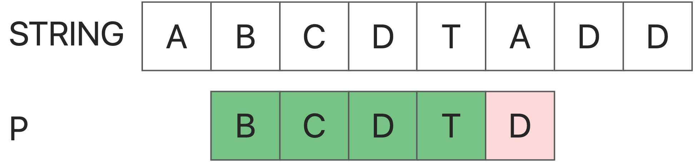
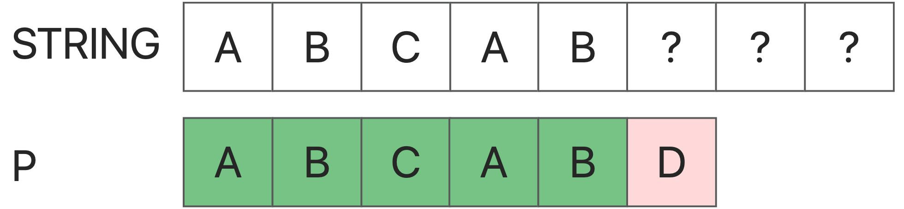
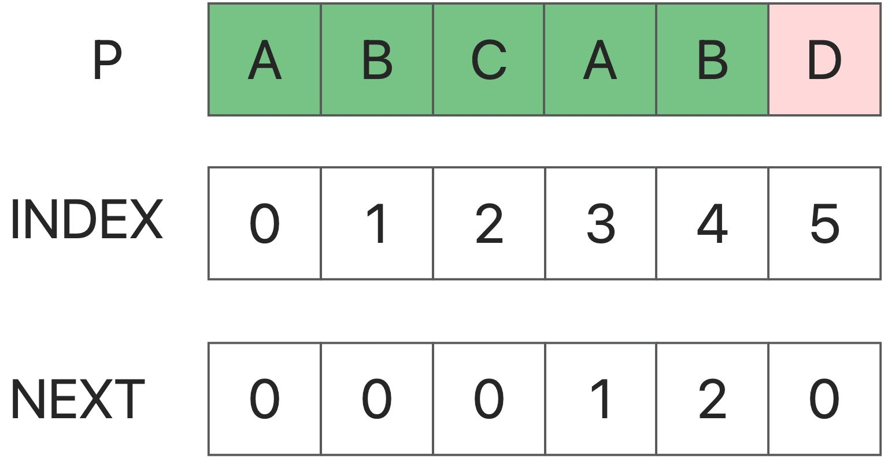
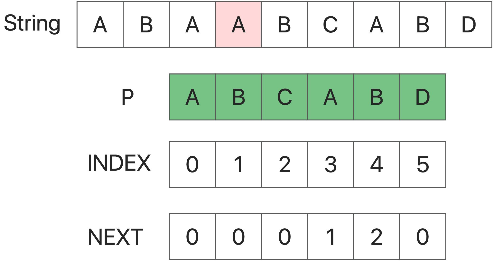
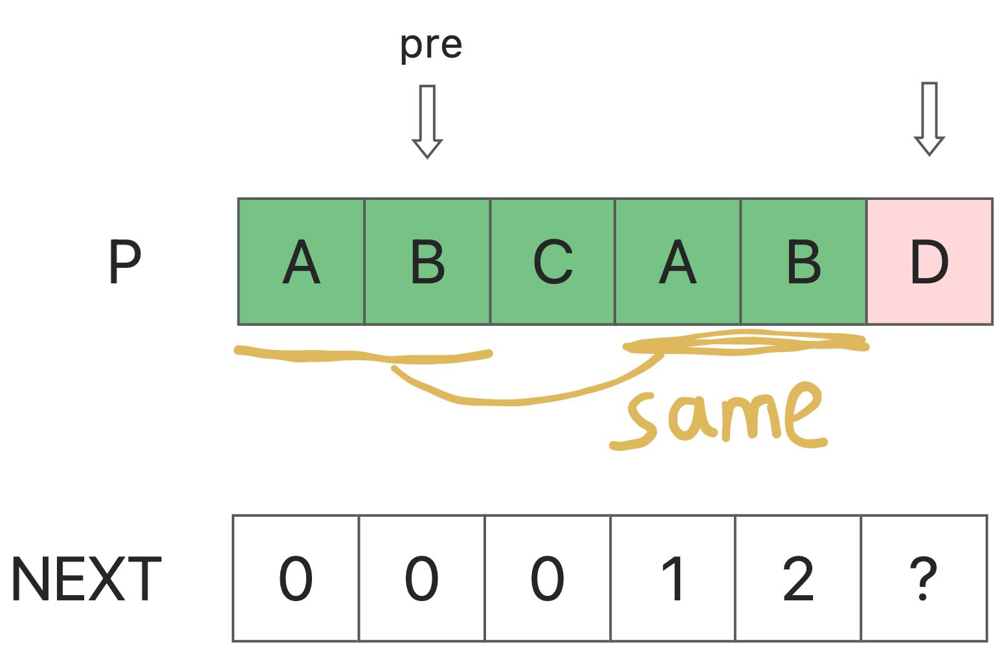

### KMP:

​	The KMP (Knuth-Morris-Pratt) algorithm is an algorithm for string search that finds the occurrence of a word W within a text string S.

The basic idea is that when a substring does not match the target string, it is known enough information to be able to determine that the next search step will not result in a missed check of the target string. In this way, the algorithm does not perform an invalid check.

The following are the steps of the KMP algorithm:

1. Construct a "partial match table" (also called a "failure function"). This is an array, and for a given lookup word, each element of the table contains the position where the lookup word should jump when the match fails. 
2. Use this table to perform string searches. When a match failure occurs in a text string, you can skip directly to the previous part that is known not to match.

<!-- more -->

### Why KMP

​	In the first approach, if the comparison from String[i] fails, the algorithm directly starts trying to compare from S[i+1]. This kind of behavior is a typical "not learning from previous mistakes".We should note that a failed match will provide us with valuable information - **if the match between String[i : i+len(P)] and P fails at the r th position, then from S[i] : the first (r-1) consecutive characters must be exactly the same as the first (r-1) characters of P**



​	Therefore, we can skip those unlikely strings as much as possible to optimize our method。

Give a Exapmle:



​	First, P[5] fails to match, then it means that S[0:5] is equal to P[0:5], which is "abcab". 

Now let's consider: from S[1], S[2], S[3] Is there any chance that the initial matching attempt will succeed?

When we start in S[1], it won't success. Because we can see : P[1] != P[0], But P[1] = S[1], So P[0] != S[1].

As same in S[2].

But when we start in S[3](it's important): **P[0] = P[3], S[3] = P[3], so P[0] = S[3].**

We can find that in S[3], it is possible to match successfully. And we will find that if it is known that S and P are the same within the length L, then whether any i can be used as the starting point of matching depends only on whether P[0] = P[i] are equal. Here we can get the core next array of the KMP algorithm

### Next Array

The next array is for the pattern string. The next array of P is defined as: **next[i] represents a substring of P[0] ~ P[i], so that the first k characters are exactly equal to the largest k of the last k characters. In particular, k cannot be i+ 1** (Because this substring has only i+1 characters in total, it must be equal to itself, so it is meaningless).  **In fact, it is to get the maximum length of the longest same prefix and suffix in the P string when different starting points i.**



### NOW, How to use next array match

```java
        int i=0;
        int j = 0;
        getNext(needle,next);
        while (i < length && j < length1)
        {
            if (j == -1 || haystack.charAt(i) == needle.charAt(j))
            {
                i++;
                j++;
            }
            else {
                j = next[j];
            }
        }
```



#### First: we use two point to mactch the Strings. The problem is how to change the point?

#### Second: 

 	String[i] != P [j] ,now we need change the j to find a new start which prefix of String is equals to P. Only in this way it may success. So, next array is useful: j = next[j]

### How to get next array

```java
void getNext(String p, int [] next)
    {
        next[0] = -1;
        int i = 0, j = -1;

        while (i < (p.length())){
            if (j == -1 || p.charAt(i)==p.charAt(j)) {
                ++i;
                ++j;
                next[i] = j;
            }
            else {
                j = next[j];
            }
        }
    }
```

this code use a small skills：make next[0] = -1 . you can remember it ,it will make easier to code;

#### dynamic programming:

next[i] means the max(i) that p[0,next[i]] = p[i-next[i],i]

so, for if we know next[0],next[1],...next[i-1], how to know next[i]?

set `next[i-1] = pre` 

if` p[i] = p[pre+1]` , it means `next[i] = pre+1`

else if `p[i] != p[pre+1],` it means `p[i-pre-1,i-1] = p[pre-1]`

we should reduce the pre. `pre = next[pre]`




### Code:

```java
/**
     * now we can use kmp algorithm，a prefix matching algorithm
     *
     */

    public int strStr(String haystack, String needle){
        //in first method,we can find that we need match all the substring if it's not match.
        //some message have been lost: the prefix of the last string we have compared.
        //we can start with the same prefix string to match,so that the time can be saved
        // we can store the same prefix in a array or list, so we called kmp algorithm
        int length = haystack.length();
        int length1 = needle.length();
        int i=0;
        int j = 0;
        int [] next = new int [length1];
        getNext(needle,next);
        while (i < length && j < length1)
        {
            if (j == -1 || haystack.charAt(i) == needle.charAt(j))
            {
                i++;
                j++;
            }
            else {
                j = next[j];
            }
        }

        if (j == length1){
            return i - j;
        }
        else {
            return -1;
        }
    }

    void getNext(String p, int [] next)
    {
        next[0] = -1;
        int i = 0, j = -1;

        while (i < (p.length())){
            if (j == -1 || p.charAt(i)==p.charAt(j)) {
                ++i;
                ++j;
                next[i] = j;
            }
            else {
                j = next[j];
            }
        }
    }
```

