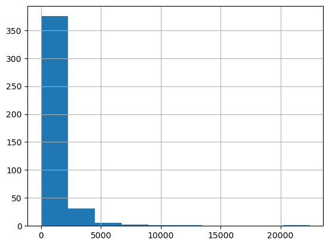
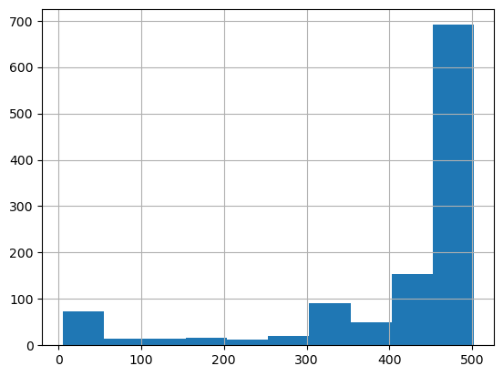

### Target:

Since there are too many files in Confluence at work, which are also cluttered and difficult to read, I hope chatGPT-based can help me quickly get the knowledge I want from the files

<!-- more -->

Here is the code of a demo, referring to the GPT official website


```python
##crawler
import requests
import re
import urllib.request
from bs4 import BeautifulSoup
from collections import deque
from html.parser import HTMLParser
from urllib.parse import urlparse
import os
import html2text
from atlassian import Confluence
import tiktoken
import pandas as pd
import openai
from openai.embeddings_utils import distances_from_embeddings
import numpy as np
from openai.embeddings_utils import distances_from_embeddings, cosine_similarity
import time


# public account and confluence space configuration
domain = "confluence.xxxxx.com"
full_url = "https://confluence.xxxxx.com/"
login_url = "https://confluence.xxxxx.com/login.action?os_destination=%2Fdologin.action"
page_url = "https://confluence.xxxxx.com/display/41JTSP/"
user_name = "xxxx"
password = "xxxx"
# Define the space key to be crawled, which is currently our space
space_key = "xxxx"
##Data saving address, please customize
filePath = ""
processPath = ""

##Separators and replacements, mainly for file name generation and title reduction
splitFlag = "$"
replaceFlag = "_"


##Setting up openai environment
openai.organization = ""
openai.api_key = ""
```


```python
def crawler(base_url,username,password,space_key,totalSpace = False):
    confluence = Confluence(url=base_url, username=username, password=password)
    ##To be implemented, crawl all spaces
    ##Get the corresponding space
    space = confluence.get_space(space_key, expand='description.plain,homepage')
    ##get space page id
    page_id = space["homepage"]["id"]
    
        # Create a directory to store the text files
    if not os.path.exists(filePath):
            os.mkdir(filePath)

    # Create a directory to store the csv files
    if not os.path.exists(processPath):
            os.mkdir(processPath)
    
    ##subpage
    child = confluence.get_page_child_by_type(page_id, type='page', start=None, limit=None, expand=None)
    
    ##init queue
    queue = deque()
    for i in child:
        queue.append(i)
    
    while queue:
        # Get the next URL from the queue
        childPage = queue.pop()
        ##get page id
        html = confluence.get_page_by_id(childPage["id"], expand="body.storage")
        # html->text
        content = html["body"]["storage"]["value"]
        content_text = html2text.html2text(content)
        
        ##insert not null
        if content_text.lstrip() != "":
            title = str(html["title"]).replace("/",replaceFlag)
    #         if not os.path.exists("/Users/lei.zhou/text/"+html["title"]):
    #             os.mkdir("/Users/lei.zhou/text/")
            with open(filePath+ childPage["id"]+splitFlag+title+ ".txt", "w") as f:
                f.write(content_text)

        ##add sub point‘
        for i in confluence.get_page_child_by_type(childPage["id"], type='page', start=None, limit=None, expand=None):
            queue.append(i)

```


```python
max_tokens = 500

def remove_newlines(serie):
    serie = serie.str.replace('\n', ' ')
    serie = serie.str.replace('\\n', ' ')
    serie = serie.str.replace('  ', ' ')
    serie = serie.str.replace('  ', ' ')
    return serie
def create_context(
    question, df, max_len=1800, size="ada"
):
    """
    Find the most similar text segment
    """
    # Get the embeddings for the question
    q_embeddings = openai.Embedding.create(input=question, engine='text-embedding-ada-002')['data'][0]['embedding']
    # Calculate the most similar text using the cosine algorithm
    df['distances'] = distances_from_embeddings(q_embeddings, df['embeddings'].values, distance_metric='cosine')


    returns = []
    cur_len = 0

    # Keep adding text to the upper limit
    for i, row in df.sort_values('distances', ascending=True).iterrows():
        
        # Text creation
        cur_len += row['n_tokens'] + 4
        
        # Exits when limit is exceeded
        if cur_len > max_len.
            break
        
        # Add text
        returns.append(row["text"])

    
    return "\n\n###\n\n".join(returns)


# token split
def split_into_many(text, max_tokens = max_tokens):

    # Define segmentation symbols, allowing customization
    sentences = re.split('[.。！？!?]',text)

    # get token for each sentence
    n_tokens = [len(tokenizer.encode(" " + sentence)) for sentence in sentences]
    
    chunks = []
    tokens_so_far = 0
    chunk = []

    
    for sentence, token in zip(sentences, n_tokens):

        # If the number of tokens so far plus the number of tokens in the current sentence is greater than,greater than the maximum number of tokens, the block is added to the list of blocks and the number of blocks and tokens so far is reset
        if tokens_so_far + token > max_tokens:
            chunks.append(". ".join(chunk) + ".")
            chunk = []
            tokens_so_far = 0

    
        if token > max_tokens:
            continue

        
        chunk.append(sentence)
        tokens_so_far += token + 1

    return chunks


def answer_question(
    df,
    model="text-davinci-003",
    question="what's your problem",
    max_len=1800,
    size="ada",
    debug=False,
    max_tokens=1800,
    stop_sequence=None,
    use_GPT=False
):
    """
    answer
    """
    context = create_context(
        question,
        df,
        max_len=max_len,
        size=size,
    )
    
    # If debug, print the raw model response
    if debug:
        print("Context:\n" + context)
        print("\n\n")
        print(f"Answer the question based on the context below, and if the question can't be answered based on the context, say \"I don't know\"\n\nContext: {context}\n\n---\n\nQuestion: {question}\nAnswer:")
    if use_GPT:
        completion = openai.ChatCompletion.create(model="gpt-3.5-turbo",messages=[
    {"role": "user", "content": f"Answer the question based on the context below, and if the question can't be answered based on the context, say \"I don't know\"\n\nContext: {context}\n\n---\n\nQuestion: {question}\nAnswer:"}])
        return completion.to_dict()["choices"][0]["message"]["content"]
    try:
        # Create a completions using the question and context
        response = openai.Completion.create(
            prompt=f"Answer the question based on the context below, and if the question can't be answered based on the context, say \"I don't know\"\n\nContext: {context}\n\n---\n\nQuestion: {question}\nAnswer:",
            temperature=0,
            max_tokens=max_tokens,
            top_p=1,
            frequency_penalty=0,
            presence_penalty=0,
            stop=stop_sequence,
            model=model,
        )
        return response["choices"][0]["text"].strip()
    except Exception as e:
        print(e)
        return ""

    
```


```python
crawler(base_url,username,password,space_key)
```

```python
#Original Text
texts=[]

for file in os.listdir(filePath):
    # file read
    with open(filePath+file, "r") as f:
        titles = file.split(splitFlag)
        if len(titles) <= 1:
            continue
        title = titles[1]
        text = f.read()
        # Title restore, replace _ with a space insert
        texts.append((title.replace(replaceFlag," "), text))
        
df = pd.DataFrame(texts, columns = ['fname', 'text'])

# split by row
df['text'] = df.fname + ". " + remove_newlines(df.text)
df.to_csv('processed/scraped.csv')
df.head()
```

</style>

<table border="1" class="dataframe">
  <thead>
    <tr style="text-align: right;">
      <th></th>
      <th>fname</th>
      <th>text</th>
    </tr>
  </thead>
  <tbody>
    <tr>
      <th>0</th>
      <td>2022-12-15【VWASP】【IDP】Scan qrcode login HU to ...</td>
      <td>2022-12-15【VWASP】【IDP】Scan qrcode login HU to ...</td>
    </tr>
    <tr>
      <th>1</th>
      <td>2022-12-19   【VWASP】【StartupBroadcasting】Conte...</td>
      <td>2022-12-19   【VWASP】【StartupBroadcasting】Conte...</td>
    </tr>
    <tr>
      <th>2</th>
      <td>bak.B1.1 Payment Center Integration Test Repor...</td>
      <td>bak.B1.1 Payment Center Integration Test Repor...</td>
    </tr>
    <tr>
      <th>3</th>
      <td>2022-03-15  [VWASP] 【ULH】DP token exchange wit...</td>
      <td>2022-03-15  [VWASP] 【ULH】DP token exchange wit...</td>
    </tr>
    <tr>
      <th>4</th>
      <td>OnlineRadio and OlineMusic B0.2 testcase revie...</td>
      <td>OnlineRadio and OlineMusic B0.2 testcase revie...</td>
    </tr>
  </tbody>
</table>


```python
tokenizer = tiktoken.get_encoding("cl100k_base")

df = pd.read_csv('processed/scraped.csv', index_col=0)
df.columns = ['title', 'text']

df['n_tokens'] = df.text.apply(lambda x: len(tokenizer.encode(x)))

df
```


</style>

<table border="1" class="dataframe">
  <thead>
    <tr style="text-align: right;">
      <th></th>
      <th>title</th>
      <th>text</th>
      <th>n_tokens</th>
    </tr>
  </thead>
  <tbody>
    <tr>
      <th>0</th>
      <td>2022-12-15【VWASP】【IDP】Scan qrcode login HU to ...</td>
      <td>2022-12-15【VWASP】【IDP】Scan qrcode login HU to ...</td>
      <td>1423</td>
    </tr>
    <tr>
      <th>1</th>
      <td>2022-12-19   【VWASP】【StartupBroadcasting】Conte...</td>
      <td>2022-12-19   【VWASP】【StartupBroadcasting】Conte...</td>
      <td>1355</td>
    </tr>
    <tr>
      <th>2</th>
      <td>bak.B1.1 Payment Center Integration Test Repor...</td>
      <td>bak.B1.1 Payment Center Integration Test Repor...</td>
      <td>1106</td>
    </tr>
    <tr>
      <th>3</th>
      <td>2022-03-15  [VWASP] 【ULH】DP token exchange wit...</td>
      <td>2022-03-15  [VWASP] 【ULH】DP token exchange wit...</td>
      <td>1429</td>
    </tr>
    <tr>
      <th>4</th>
      <td>OnlineRadio and OlineMusic B0.2 testcase revie...</td>
      <td>OnlineRadio and OlineMusic B0.2 testcase revie...</td>
      <td>2736</td>
    </tr>
    <tr>
      <th>...</th>
      <td>...</td>
      <td>...</td>
      <td>...</td>
    </tr>
    <tr>
      <th>412</th>
      <td>B1 OnePortal Qulification Test Report.txt</td>
      <td>B1 OnePortal Qulification Test Report.txt.   #...</td>
      <td>966</td>
    </tr>
    <tr>
      <th>413</th>
      <td>Detailed Solution Architecture.txt</td>
      <td>Detailed Solution Architecture.txt. 250</td>
      <td>8</td>
    </tr>
    <tr>
      <th>414</th>
      <td>B1.3 Release.txt</td>
      <td>B1.3 Release.txt. true</td>
      <td>9</td>
    </tr>
    <tr>
      <th>415</th>
      <td>04  B1验收Charging&amp;RBC.txt</td>
      <td>04  B1验收Charging&amp;RBC.txt.  L1| L2| L3| | | L4|...</td>
      <td>1492</td>
    </tr>
    <tr>
      <th>416</th>
      <td>ULH - Integration Outline and API-Specificatio...</td>
      <td>ULH - Integration Outline and API-Specificatio...</td>
      <td>38</td>
    </tr>
  </tbody>
</table>
<p>417 rows × 3 columns</p>

</div>


```python
# Tokenize the text and save the number of tokens to a new column
df['n_tokens'] = df.text.apply(lambda x: len(tokenizer.encode(x)))

# Visualize the distribution of the number of tokens per row using a histogram
df.n_tokens.hist()
```


    <AxesSubplot:>



​    


```python
shortened = []

# Cyclic text reduction
for row in df.iterrows():
    print(row)

    if row[1]['text'] is None:
        continue

    if row[1]['n_tokens'] > max_tokens:
        shortened += split_into_many(row[1]['text'])
    else:
        shortened.append( row[1]['text'] )
df = pd.DataFrame(shortened, columns = ['text'])
df['n_tokens'] = df.text.apply(lambda x: len(tokenizer.encode(x)))
df.n_tokens.hist()
```



​    


```python
## Due to the official limit, a maximum of 60 requests initiated in 1 minute, so to prevent the reporting of errors here active hibernation
## due to the amount of data is too large, if you can not run, you can intercept part of the data in the above column df = df[0:x] x is the interception length
def cal(x,waittime = 0.6):
    res = openai.Embedding.create(input=x, engine='text-embedding-ada-002')['data'][0]['embedding']
    time.sleep(waittime)
    return res
df['embeddings'] = df.text.apply(lambda x: cal(x))

df.to_csv('processed/embeddings.csv')
df.head()
```


</style>

<table border="1" class="dataframe">
  <thead>
    <tr style="text-align: right;">
      <th></th>
      <th>text</th>
      <th>n_tokens</th>
      <th>embeddings</th>
    </tr>
  </thead>
  <tbody>
    <tr>
      <th>0</th>
      <td>2022-12-15【VWASP】【IDP】Scan qrcode login HU to ...</td>
      <td>472</td>
      <td>[-0.0035752991680055857, 0.015155627392232418,...</td>
    </tr>
    <tr>
      <th>1</th>
      <td>| 11 incomplete | /  6 | 用例设计是否包含充分的正面、负面异常测试...</td>
      <td>343</td>
      <td>[0.012331507168710232, 0.002946529071778059, -...</td>
    </tr>
    <tr>
      <th>2</th>
      <td>2022-12-19   【VWASP】【StartupBroadcasting】Conte...</td>
      <td>454</td>
      <td>[0.004054947756230831, -0.0028905682265758514,...</td>
    </tr>
    <tr>
      <th>3</th>
      <td>| 203 complete OK |  |   **专属部分** |  | 检查人：Zh...</td>
      <td>492</td>
      <td>[0.019448528066277504, 0.00747803645208478, 0....</td>
    </tr>
    <tr>
      <th>4</th>
      <td>bak. B1. 1 Payment Center Integration Test Rep...</td>
      <td>481</td>
      <td>[0.0010055731981992722, -0.013514618389308453,...</td>
    </tr>
  </tbody>
</table>

</div>


```python
##read token
df=pd.read_csv('processed/embeddings.csv', index_col=0)
df['embeddings'] = df['embeddings'].apply(eval).apply(np.array)
df.head()
```


</style>

<table border="1" class="dataframe">
  <thead>
    <tr style="text-align: right;">
      <th></th>
      <th>text</th>
      <th>n_tokens</th>
      <th>embeddings</th>
    </tr>
  </thead>
  <tbody>
    <tr>
      <th>0</th>
      <td>2022-12-15【VWASP】【IDP】Scan qrcode login HU to ...</td>
      <td>472</td>
      <td>[-0.0035752991680055857, 0.015155627392232418,...</td>
    </tr>
    <tr>
      <th>1</th>
      <td>| 11 incomplete | /  6 | 用例设计是否包含充分的正面、负面异常测试...</td>
      <td>343</td>
      <td>[0.012331507168710232, 0.002946529071778059, -...</td>
    </tr>
    <tr>
      <th>2</th>
      <td>2022-12-19   【VWASP】【StartupBroadcasting】Conte...</td>
      <td>454</td>
      <td>[0.004054947756230831, -0.0028905682265758514,...</td>
    </tr>
    <tr>
      <th>3</th>
      <td>| 203 complete OK |  |   **专属部分** |  | 检查人：Zh...</td>
      <td>492</td>
      <td>[0.019448528066277504, 0.00747803645208478, 0....</td>
    </tr>
    <tr>
      <th>4</th>
      <td>bak. B1. 1 Payment Center Integration Test Rep...</td>
      <td>481</td>
      <td>[0.0010055731981992722, -0.013514618389308453,...</td>
    </tr>
  </tbody>
</table>
</div>


```python
##Enter the maximum token and return the length for questioning, here we use Chinese for testing to check the applicability of different languages
answer_question(df, question="测试用例需要满足那些要求?", debug=False,use_GPT=True,max_len=1800,max_tokens = 1800)
```


    '测试用例需要满足许多要求，包括但不限于：前提条件、输入数据和期待结果清晰、明确；包含充分的正面、负面异常测试用例；是否从用户层面来设计用户使用场景和使用流程的测试用例；是否简洁，复用性强等。具体要求见上文中的各项检查项。'


```python
answer_question(df, question="一份DD文档或是AD文档需要满足那些要求?,请用中文回答", debug=False,use_GPT=True,max_len=1800,max_tokens = 1800)
```


    'DD文档或AD文档需要满足以下要求：\n1. 它应该清晰明了，包括应用的功能、性能、界面、安全等方面。\n2. 它应该易于理解，包括适当的说明、流程图、状态图等。\n3. 它应该满足可复用性、易维护性等软件工程的基本原则。\n4. 它应该包括可靠性需求，描述系统的可用性、健壮性等需求。\n5. 它应该考虑约束和假设，包括客户和MA的约束和假设。\n6. 它应该包括详细设计，以阐明更改的原因和过程，并进行一致性评估。\n7. 它应该考虑软件单元的互操作性、交互、关键性、技术复杂性、风险和可测试性等方面。 \n8. 它应该包括接口定义，以使接口清楚明了。\n9. 历史记录应该得到正确维护。'


