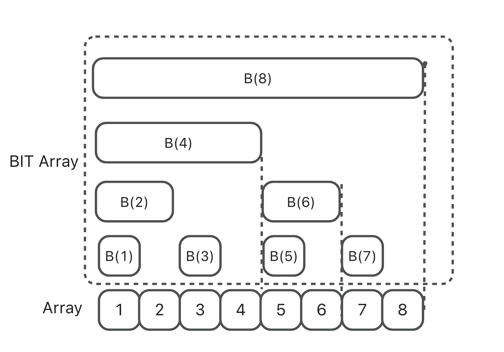

## Binary Indexed Tree and Its Applications on LeetCode

### Why Do We Need a Binary Indexed Tree?

#### Problem Setup

**Question**:  
Given an integer array `input = [1,2,7,4,3]`, how can we quickly calculate the sum of the first *K* numbers?

**Solution**:  
A common approach is to build a prefix sum array `preSumArray`, where `preSumArray[i]` represents the sum of the first *i* elements.  
With this, the sum of the first *N* numbers can be retrieved in O(1) time. If we need to perform *K* queries, the total complexity is O(K).

#### Making It Harder

**Question**:  
Now suppose we still want to query prefix sums on the same array `input = [1,2,7,4,3]`, but before querying we might increase or decrease the value at index *i*.

**Solution**:  
If we continue to rely on `preSumArray`, then every update at position *i* requires modifying all subsequent entries of the array.  
That means each update costs O(N), and *K* queries with updates would cost O(KN).  

If we abandon `preSumArray`, updates are O(1), but each query would degrade to O(N).

**This is where a Binary Indexed Tree (Fenwick Tree) helps us balance both operations efficiently.**

---

#### Prerequisite: A Binary Trick

A useful bitwise operation in this context is:

```
lowbit(x) = x & (-x)
```

This extracts the largest power of 2 that divides *x*, i.e., the value of the rightmost 1 bit.

Examples:

- `5 & -5 = 1`
- `10 & -10 = 2`
- `12 & -12 = 4`

---

#### Binary Indexed Tree (Fenwick Tree)

##### Definition

Conceptually, it’s still an array—similar to a prefix sum array—but instead of storing complete prefix sums, it stores the sum of the last `lowbit(i)` elements up to index *i*.



```
B(1) = A(1);
B(2) = A(1)+A(2);
B(3) = A(3);
B(4) = A(1)+A(2)+A(3)+A(4);
B(5) = A(5);
B(6) = A(5)+A(6);
B(7) = A(7);
B(8) = A(1)+A(2)+A(3)+A(4)+A(5)+A(6)+A(7)+A(8);
```

> Note: The index of a Binary Indexed Tree must start from 1.

---

##### Core Operations

The Binary Indexed Tree mainly supports two operations: **prefix sum queries** and **updates**.

###### Querying Prefix Sums

Example:

```
getSum(7) = A(1)+...+A(7) = B(4)+B(6)+B(7)
getSum(6) = B(4)+B(6)
```

Implementation:

```java
public int getSum(int x) {
    int res = 0;
    for (int i = x; i > 0; i -= lowbit(i)) {
        res += bit[i];
    }
    return res;
}
```

Recursive form:

```java
public int getSum(int x) {
    if (x <= 0) {
        return 0;
    }
    return bit[x] + getSum(x - lowbit(x));
}
```

Time complexity: **O(log N)**  

For a range sum `sum(i, j)`, simply compute `getSum(j) - getSum(i-1)`.

---

###### Updating Values

Example: `update(6, 7)` means adding 7 to position 6. This requires updating `B(6)` and `B(8)`.

Implementation:

```java
public void update(int x, int value) {
    for (int i = x; i < bit.length; i += lowbit(i)) {
        bit[i] += value;
    }
}
```

---

### Applications on LeetCode

#### LeetCode 493 — Reverse Pairs

**Question**:  
Given an array `nums`, a pair `(i, j)` is called a **reverse pair** if `i < j` and `nums[i] > 2*nums[j]`.  
Return the total number of reverse pairs.

**Example Input:**

```
[1,3,2,3,1]
```

**Output:**

```
2
```

**Solution**:

We can transform the problem into:  
> For each `j`, count how many elements to its left are greater than `2 * nums[j]`.

Steps:

1. Sort and discretize the array into a mapped range `1..n`.  
2. Count occurrences of each number.  
3. Use a BIT to query prefix sums over the mapped values.

**Code**:

```java
class Solution {
    class TrieArr {
        long[] arr;
        public TrieArr(int n) { arr = new long[n]; }
        public int lowbit(int x) { return x & -x; }
        public int getSum(int x) {
            if (x <= 0) return 0;
            return (int)(arr[x] + getSum(x - lowbit(x)));
        }
        public void update(int x, int c) {
            for (int i = x; i < arr.length; i += lowbit(i)) arr[i] += c;
        }
    }

    public int reversePairs(int[] nums) {
        Map<Long,Integer> map = new HashMap<>();
        TreeSet<Long> set = new TreeSet<>();
        for (int i : nums) {
            set.add((long)i);
            set.add((long)i * 2);
        }
        int index = 1;
        while (!set.isEmpty()) {
            map.put(set.pollFirst(), index++);
        }
        TrieArr bit = new TrieArr(map.size() + 1);
        int ans = 0;
        for (int i = 0; i < nums.length; i++) {
            long target = (long)nums[i] * 2;
            int l = map.get(target);
            ans += bit.getSum(map.size()) - bit.getSum(l);
            bit.update(map.get((long)nums[i]), 1);
        }
        return ans;
    }
}
```

---

#### Similar Problems

- LeetCode 307 — Range Sum Query – Mutable  
- …and many others that require efficient prefix sums with updates.
