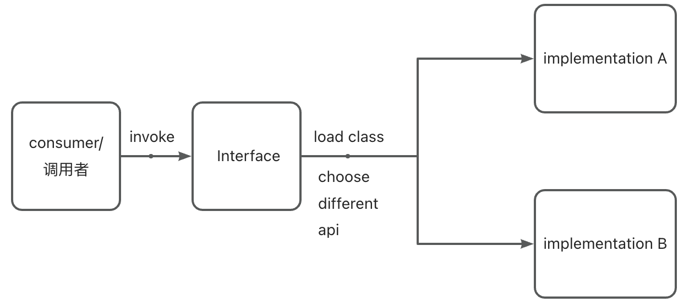
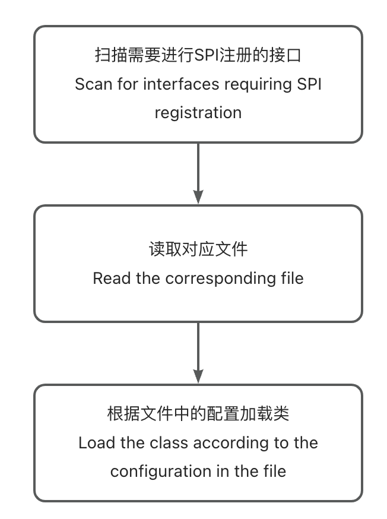
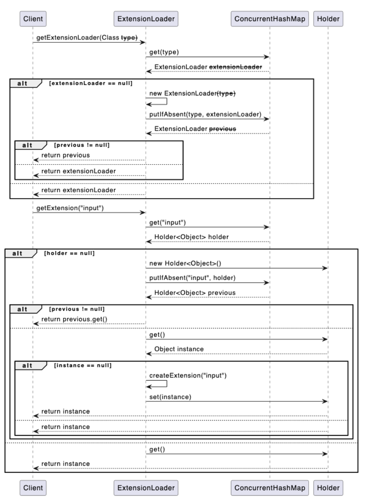

# Java SPI application

## Spi definition

In Java, SPI stands for Service Provider Interface. SPI is a mechanism that allows applications to extend their functionality by discovering and loading pluggable components or service providers found on the classpath. It provides a loosely coupled way to enable developers to write code that can interact with multiple implementations without explicitly referencing specific implementation classes.

## Difference between API and SPI

API is used to define the interaction rules and conventions between software components, while SPI is a mechanism for achieving the extensibility of pluggable components or services.

API is used to expose functionalities and features for other developers to use and integrate, while SPI is used for dynamically loading and utilizing replaceable components for implementation.

API is developer-oriented, providing programming interfaces and documentation for the correct use and integration of software components. SPI is developer- and framework/application-oriented, used to extend the functionality of frameworks or applications.

API is defined by the caller, specifying the calling methods and parameters. SPI is defined by the callee, allowing the caller to provide implementations.

## Spi mechanism



## Implementation process



## Implementation in Rpc

In the [simple RPC framework implementation](https://github.com/pjpjsocute/rpc-service), an annotation-based SPI mechanism was implemented based on Dubbo. Here, the principle will be briefly introduced.

### Implementation:

#### 1

Define an SPI annotation to mark all interfaces that need SPI registration

```java
@Documented
@Retention(RetentionPolicy.RUNTIME)
@Target(ElementType.TYPE)
public @interface SPI {
}
```

Secondly, since to prevent concurrency conflicts, a wrapper class is used to wrap the instance interface to ensure data security in multi-threaded processes.

```java
public class Holder<T> {

    private volatile T value;

    public T get() {
        return value;
    }

    public void set(T value) {
        this.value = value;
    }
}
```

holder can serve as a lock object to ensure security.

Refer to Spring SPI, the configuration file for extensions is defined in the following format: key = 'full path', such as zk=org.example.ray.infrastructure.adapter.impl.RpcServiceFindingAdapterImpl

This allows for easy creation, retrieval, and invocation within the system using the key

#### 2

To avoid issues with repeated loading and creation, a map is used as a cache. Additionally, to improve retrieval efficiency, different extension instances are cached for different services.

```java
public final class ExtensionLoader<T> {
		//extention path
    private static final String                            SERVICE_DIRECTORY   = "META-INF/extension/";
  	//save extentionloader for load different class
    private static final Map<Class<?>, ExtensionLoader<?>> EXTENSION_LOADERS   = new ConcurrentHashMap<>();
  	//save all instance
    private static final Map<Class<?>, Object>             EXTENSION_INSTANCES = new ConcurrentHashMap<>();

    private final Class<?>                                 type;
  	//save different service hold instance
    private final Map<String, Holder<Object>>              cachedInstances     = new ConcurrentHashMap<>();
  	//save different instance
    private final Holder<Map<String, Class<?>>>            cachedClasses       = new Holder<>();
  
  private ExtensionLoader(Class<?> type) {
        this.type = type;
    }
}
```

#### 3

Implement methods to retrieve the classloader and getExtension

