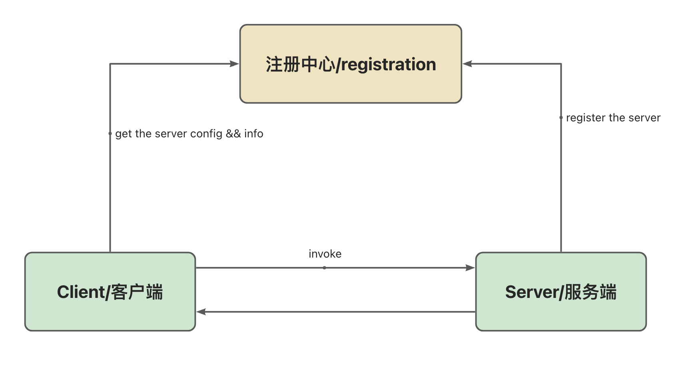

# Based on SpringBoot, handwrite a simple RPC framework (part one)

* * *

Code:pjpjsocute/rpc-service: personal rcp attempt (github.com) Technology stack includes: springboot, zookeeper, netty, java spi

* * *

## RPC definition

Remote Procedure Call (RPC) is a communication mechanism that allows different services to communicate and interact over a network.

Through RPC, one service can make a request to another service and receive a response, just like a local call, without developers manually handling the underlying network communication details. The RPC framework encapsulates the underlying network transmission and provides functions such as defining remote service interfaces, serializing and deserializing data.

### Distinguishing RPC from HTTP:

HTTP is an application-layer protocol used for transmitting hypermedia. It facilitates communication between clients and servers. It operates on a request-response model, where the client sends an HTTP request to the server, and the server processes the request and returns an appropriate HTTP response. RPC is more similar to an architectural concept; RPC can be implemented using HTTP or TCP.

## RPC Process

A simple RPC architecture is shown as follows:



## Implementation method:

### A simple RPC call chain:


## Server implementation based on netty and ZK

According to the figure above, we first need to implement service registration.

### Service registration:

Currently, most RPC frameworks support registration through annotations, and the same approach is used here.

#### Define the registration annotation

```java
@Documented
@Retention(RetentionPolicy.RUNTIME)
@Target({ElementType.TYPE})
@Inherited
public @interface RpcProvider {

    /**
     * Service group, default value is empty string
     */
    String project() default "default";

    /**
     * Service version, default value is 1.0
     * 
     * @return
     */
    String version() default "1.0";

    /**
     * Service group, default value is empty string
     */
    String group() default "default";

}

@Documented
@Retention(RetentionPolicy.RUNTIME)
@Target({ElementType.FIELD, ElementType.TYPE})
@Inherited
public @interface RpcConsumer {
    /**
     * Service project, default value is empty string
     */
    String project() default "default";

    /**
     * Service version, default value is 1.0
     * 
     * @return
     */
    String version() default "1.0";

    /**
     * Service group, default value is empty string
     */
    String group() default "default";
}

@Target({ElementType.TYPE, ElementType.METHOD})
@Retention(RetentionPolicy.RUNTIME)
@Import(CustomBeanScannerRegistrar.class)
@Documented
public @interface SimpleRpcApplication {

    String[] basePackage();
}
```

This annotation will define the service version, group (to distinguish different interfaces with the same name in the same project), project name, used for service exposure.

Similarly, an annotation is also needed for consumption; an annotation to define the packages to be scanned

#### Register the service at startup

##### First, it is necessary to register the annotation with @provider

Get the package that needs to be scanned, then register the annotated bean into Spring

```java
public class CustomBeanScannerRegistrar implements ImportBeanDefinitionRegistrar, ResourceLoaderAware {

    private ResourceLoader resourceLoader;

    private static final String API_SCAN_PARAM = "basePackage";

    private static final String SPRING_BEAN_BASE_PACKAGE = "org.example.ray";

    @Override
    public void registerBeanDefinitions(AnnotationMetadata importingClassMetadata, BeanDefinitionRegistry registry) {
        //get the scan annotation and the bean package to be scanned
        String[] scanBasePackages = fetchScanBasePackage(importingClassMetadata);
        LogUtil.info("scanning packages: [{}]", (Object) scanBasePackages);
        
//        //scan the package and register the bean
//        RpcBeanScanner rpcConsumerBeanScanner = new RpcBeanScanner(registry, RpcConsumer.class);
        RpcBeanScanner rpcProviderBeanScanner = new RpcBeanScanner(registry, RpcProvider.class);
        RpcBeanScanner springBeanScanner = new RpcBeanScanner(registry, Component.class);
        if (resourceLoader != null) {
            springBeanScanner.setResourceLoader(resourceLoader);
            rpcProviderBeanScanner.setResourceLoader(resourceLoader);
        }
        int rpcServiceCount = rpcProviderBeanScanner.scan(scanBasePackages);
        LogUtil.info("rpcServiceScanner扫描的数量 [{}]", rpcServiceCount);
        LogUtil.info("scanning RpcConsumer annotated beans end");
    }

    @Override
    public void setResourceLoader(ResourceLoader resourceLoader) {
        this.resourceLoader = resourceLoader;
    }
    
    private String[] fetchScanBasePackage(AnnotationMetadata importingClassMetadata){
        AnnotationAttributes annotationAttributes = AnnotationAttributes.fromMap(importingClassMetadata.getAnnotationAttributes(SimpleRpcApplication.class.getName()));
        String[] scanBasePackages = new String[0];
        if (annotationAttributes != null) {
            scanBasePackages = annotationAttributes.getStringArray(API_SCAN_PARAM);
        }
        //user doesn't specify the package to scan,use the Application base package
        if (scanBasePackages.length == 0) {
            scanBasePackages = new String[]{((org.springframework.core.type.StandardAnnotationMetadata) importingClassMetadata).getIntrospectedClass().getPackage().getName()};
        }
        return scanBasePackages;
    }

}
```

##### Register the service and related configurations before the bean initialization to ensure that the service has been successfully registered after Spring starts

```java
@Component
public class RpcBeanPostProcessor implements BeanPostProcessor {

    private final RpcServiceRegistryAdapter adapter;

    private final RpcSendingServiceAdapter  sendingServiceAdapter;

    public RpcBeanPostProcessor() {
        this.adapter = SingletonFactory.getInstance(RpcServiceRegistryAdapterImpl.class);;
        this.sendingServiceAdapter = ExtensionLoader.getExtensionLoader(RpcSendingServiceAdapter.class)
            .getExtension(RpcRequestSendingEnum.NETTY.getName());
    }

    /**
     * register service
     *
     * @param bean
     * @param beanName
     * @return
     * @throws BeansException
     */
    @Override
    public Object postProcessBeforeInitialization(Object bean, String beanName) throws BeansException {
        LogUtil.info("start process register service: {}", bean);
        // register service
        if (bean.getClass().isAnnotationPresent(RpcProvider.class)) {
            RpcProvider annotation = bean.getClass().getAnnotation(RpcProvider.class);
            // build rpc service config
            RpcServiceConfig serviceConfig = RpcServiceConfig.builder()
                .service(bean)
                .project(annotation.project())
                .version(annotation.version())
                .group(annotation.group())
                .build();
            LogUtil.info("register service: {}", serviceConfig);
            adapter.registryService(serviceConfig);
        }
        return bean;
    }
}
```

##### Implement the specific method for service registration

To register a service, at least it should include: service provider (IP), service name, and variables in @RpcProvider, so, you can first define an RpcServiceConfig.

```java
@Data
@NoArgsConstructor
@AllArgsConstructor
@Builder
public class RpcServiceConfig {
    /**
     * service version
     */
    private String version = "";

    /**
     * target service
     */
    private Object service;

    /**
     * belong to which project
     */
    private String project = "";

    /**
     * group
     */
    private String group   = "";

    /**
     * generate service name,use to distinguish different service,and * can be split to get the service name
     * @return
     */
    public String fetchRpcServiceName() {
        return this.getProject() + "*" + this.getGroup() + "*" + this.getServiceName() + "*" + this.getVersion();
    }

    /**
     * get the interface name
     * 
     * @return
     */
    public String getServiceName() {
        return this.service.getClass().getInterfaces()[0].getCanonicalName();
    }

}
```

Provide 2 methods, register services, and get the corresponding bean based on service names

```java
public interface RpcServiceRegistryAdapter {

    /**
     * @param rpcServiceConfig rpc service related attributes
     */
    void registryService(RpcServiceConfig rpcServiceConfig);

    /**
     * @param rpcClassName rpc class name
     * @return service object
     */
    Object getService(String rpcClassName);

}
```

The registration process can be divided into 3 steps: 

- generate address -> 

- register service into Zookeeper -> 

- register into cache. 

Here, a ConcurrentHashMap is used to cache services (the method finally calls the Zookeeper API for registration, as it is not closely related to RPC, so it is omitted, and you can refer to the source code directly).

```java
public class RpcServiceRegistryAdapterImpl implements RpcServiceRegistryAdapter {

    /**
     * cache map
     */
    private final Map<String, Object> serviceMap = new ConcurrentHashMap<>();

    @Override
    public void registryService(RpcServiceConfig rpcServiceConfig) {
        try {
            // first get address and service
            String hostAddress = InetAddress.getLocalHost().getHostAddress();
            // add service to zk
            LogUtil.info("add service to zk,service name{},host:{}", rpcServiceConfig.fetchRpcServiceName(),hostAddress);
            registerServiceToZk(rpcServiceConfig.fetchRpcServiceName(),
                new InetSocketAddress(hostAddress, PropertiesFileUtil.readPortFromProperties()));
            // add service to map cache
            registerServiceToMap(rpcServiceConfig);
        } catch (UnknownHostException e) {
            LogUtil.error("occur exception when getHostAddress", e);
            throw new RuntimeException(e);
        }

    }

    @Override
    public Object getService(String rpcServiceName) {
        Object service = serviceMap.get(rpcServiceName);
        if (null == service) {
            throw new RpcException(RpcErrorMessageEnum.SERVICE_CAN_NOT_BE_FOUND.getCode(),"service not found");
        }
        return service;
    }

    private void registerServiceToZk(String rpcServiceName, InetSocketAddress inetSocketAddress) {
        String servicePath = CuratorClient.ZK_REGISTER_ROOT_PATH + "/" + rpcServiceName + inetSocketAddress.toString();
        CuratorFramework zkClient = CuratorClient.getZkClient();
        CuratorClient.createPersistentNode(zkClient, servicePath);
    }

    private void registerServiceToMap(RpcServiceConfig rpcServiceConfig) {
        String rpcServiceName = rpcServiceConfig.fetchRpcServiceName();
        if (serviceMap.containsKey(rpcServiceName)) {
            return;
        }
        serviceMap.put(rpcServiceName, rpcServiceConfig.getService());
    }
}
```

 At this point, the registration process for a service is complete.