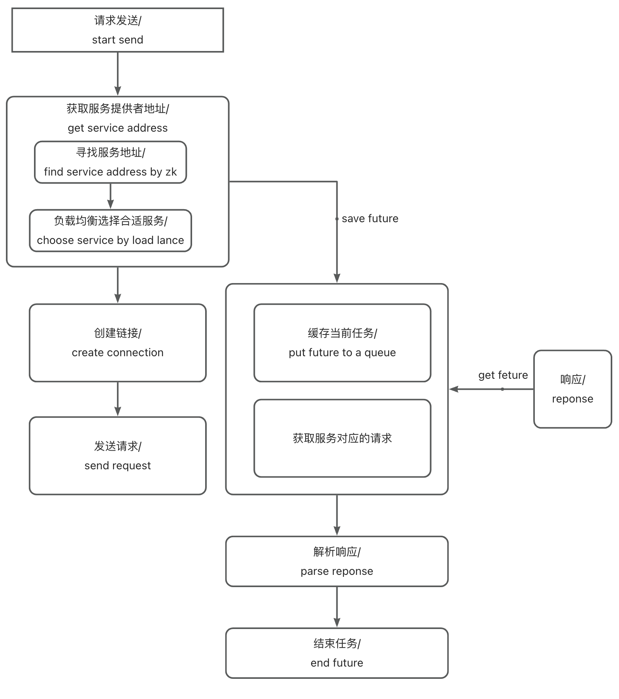

# Based on SpringBoot, Handwritten Simple RPC Framework (Three)


Continuing from the previous chapter, after implementing server registration and invocation, the next step is to implement client functionality, which mainly includes load balancing, rate limiting, request sending, and service discovery. Next, we will implement the following features in the order of an RPC call process.

### A single request:

Before implementing the client, it's first necessary to consider what needs to be sent in a single request.

First, the current service name method name, as well as the corresponding parameters and parameter types, are needed, otherwise the server cannot perform the corresponding reflection call based on the request.

Second, the request should include the parameters within @RpcConsumer so that the server can locate the correct service.

Finally, the request should include a unique value for this request to facilitate traceability.

At this point, the basic parameters required for a request have been completed.

```java
@Data
@AllArgsConstructor
@NoArgsConstructor
@Builder
public class RpcRequest implements Serializable {

    private static final long serialVersionUID = 8509587559718339795L;
    /**
     * traceId
     */
    private String            traceId;
    /**
     * interface name
     */
    private String            serviceName;
    /**
     * method name
     */
    private String            methodName;
    /**
     * parameters
     */
    private Object[]          parameters;
    /**
     * parameter types
     */
    private Class<?>[]        paramTypes;
    /**
     * version
     */
    private String            version;
    /**
     * group
     */
    private String            project;

    private String            group;

    /**
     * generate service name,use to distinguish different service,and * can be
     * split to get the service name
     */
    public String fetchRpcServiceName() {
        return this.getProject() + "*" + this.getGroup() + "*" + this.getServiceName() + "*" + this.getVersion();
    }

}
```

### Service Proxy

First step, during the Spring startup process, scan all classes annotated with @RpcConsumer to generate proxies. Subsequent calls to methods in these classes will invoke the proxy methods, which then initiate requests.

```java
@Component
public class RpcBeanPostProcessor implements BeanPostProcessor {

    private final RpcServiceRegistryAdapter adapter;

    private final RpcSendingServiceAdapter  sendingServiceAdapter;

    public RpcBeanPostProcessor() {
        this.adapter = SingletonFactory.getInstance(RpcServiceRegistryAdapterImpl.class);;
        this.sendingServiceAdapter = ExtensionLoader.getExtensionLoader(RpcSendingServiceAdapter.class)
            .getExtension(RpcRequestSendingEnum.NETTY.getName());
    }

    /**
     * register service
     *
     * @param bean
     * @param beanName
     * @return
     * @throws BeansException
     */
    @Override
    public Object postProcessBeforeInitialization(Object bean, String beanName) throws BeansException {
        LogUtil.info("start process register service: {}", bean);
        // register service
        if (bean.getClass().isAnnotationPresent(RpcProvider.class)) {
            RpcProvider annotation = bean.getClass().getAnnotation(RpcProvider.class);
            // build rpc service config
            RpcServiceConfig serviceConfig = RpcServiceConfig.builder()
                .service(bean)
                .project(annotation.project())
                .version(annotation.version())
                .group(annotation.group())
                .build();
            LogUtil.info("register service: {}", serviceConfig);
            adapter.registryService(serviceConfig);
        }
        return bean;
    }

    /**
     * proxy and injection of consumers
     *
     * @param bean
     * @param beanName
     * @return
     * @throws BeansException
     */
    @Override
    public Object postProcessAfterInitialization(Object bean, String beanName) throws BeansException {
        Class<?> toBeProcessedBean = bean.getClass();
        Field[] declaredFields = toBeProcessedBean.getDeclaredFields();
        for (Field declaredField : declaredFields) {
            if (declaredField.isAnnotationPresent(RpcConsumer.class)) {
                RpcConsumer annotation = declaredField.getAnnotation(RpcConsumer.class);
                // build rpc service config
                RpcServiceConfig serviceConfig = RpcServiceConfig.builder()
                    .project(annotation.project())
                    .version(annotation.version())
                    .group(annotation.group())
                    .build();
                // create the proxy bean Factory and the proxy bean
                RpcServiceProxy proxy = new RpcServiceProxy(sendingServiceAdapter, serviceConfig);
                Object rpcProxy = proxy.getProxy(declaredField.getType());
                declaredField.setAccessible(true);
                try {
                    LogUtil.info("create service proxy: {}", bean);
                    declaredField.set(bean, rpcProxy);
                } catch (IllegalAccessException e) {
                    e.printStackTrace();
                }
            }
        }
        return bean;
    }
}
```

Next, in the invoke method of the proxy class, implement the assembly and invocation of the request. Simultaneously, retrieve the response value from the Future and return it to the caller.

```java
public class RpcServiceProxy implements InvocationHandler {

    private final RpcSendingServiceAdapter sendingServiceAdapter;

    private final RpcServiceConfig         config;

    public RpcServiceProxy(RpcSendingServiceAdapter sendingServiceAdapter, RpcServiceConfig config) {
        this.sendingServiceAdapter = sendingServiceAdapter;
        this.config = config;
    }

    @Override
    public Object invoke(Object proxy, Method method, Object[] args) {
        LogUtil.info("invoked method: [{}]", method.getName());
        RpcRequest rpcRequest = buildRequest(method,args);

        RpcResponse<Object> rpcResponse = null;
        CompletableFuture<RpcResponse<Object>> completableFuture =
            (CompletableFuture<RpcResponse<Object>>)sendingServiceAdapter.sendRpcRequest(rpcRequest);
        try {
            rpcResponse = completableFuture.get();
            return rpcResponse.getData();
        } catch (Exception e) {
            LogUtil.error("occur exception:", e);
        }
        return null;
    }

    /**
     * get the proxy object
     */
    @SuppressWarnings("unchecked")
    public <T> T getProxy(Class<T> clazz) {
        return (T)Proxy.newProxyInstance(clazz.getClassLoader(), new Class<?>[] {clazz}, this);
    }

     private RpcRequest buildRequest(Method method,Object[] args){
         RpcRequest rpcRequest = RpcRequest.builder()
                 .methodName(method.getName())
                 .parameters(args)
                 .serviceName(method.getDeclaringClass().getName())
                 .paramTypes(method.getParameterTypes())
                 .traceId(UUID.randomUUID().toString())
                 .project(config.getProject())
                 .version(config.getVersion())
                 .group(config.getGroup())
                 .build();
        return rpcRequest;
     }
}
```

### Sending Request:

The core method of the client is to send requests, and there are multiple methods for sending requests. Here, only the implementation based on Netty's Nio is demonstrated. Below is a complete sequence.



First, implement the send method, which should include the functionality of finding addresses and sending requests.

```java
public class RpcSendingServiceAdapterImpl implements RpcSendingServiceAdapter {

    /**
     * EventLoopGroup is a multithreaded event loop that handles I/O operation.
     */
    private final EventLoopGroup             eventLoopGroup;

    /**
     * Bootstrap helt setting and start netty client
     */
    private final Bootstrap                  bootstrap;

    /**
     * Service discovery
     */
    private final RpcServiceFindingAdapter   findingAdapter;

    /**
     * Channel manager,mapping channel and address
     */
    private final AddressChannelManager      addressChannelManager;

    /**
     * Waiting process request queue
     */
    private final WaitingProcessRequestQueue waitingProcessRequestQueue;

    public RpcSendingServiceAdapterImpl() {
        this.findingAdapter = ExtensionLoader.getExtensionLoader(RpcServiceFindingAdapter.class)
            .getExtension(ServiceDiscoveryEnum.ZK.getName());
        this.addressChannelManager = SingletonFactory.getInstance(AddressChannelManager.class);
        this.waitingProcessRequestQueue = SingletonFactory.getInstance(WaitingProcessRequestQueue.class);
        // initialize
        eventLoopGroup = new NioEventLoopGroup();
        bootstrap = new Bootstrap();
        bootstrap.group(eventLoopGroup)
            .channel(NioSocketChannel.class)
            .handler(new LoggingHandler(LogLevel.INFO))
            // The timeout period for the connection.
            // If this time is exceeded or if the connection cannot be
            // established, the connection fails.
            .option(ChannelOption.CONNECT_TIMEOUT_MILLIS, 5000)
            .handler(new ChannelInitializer<SocketChannel>() {
                @Override
                protected void initChannel(SocketChannel ch) {
                    ChannelPipeline p = ch.pipeline();
                    // If no data is sent to the server within 15 seconds, a
                    // heartbeat request is sent
                    p.addLast(new IdleStateHandler(0, 5, 0, TimeUnit.SECONDS));
                    p.addLast(new RpcMessageEncoder());
                    p.addLast(new RpcMessageDecoder());
                    p.addLast(new NettyRpcClientHandler());
                }
            });
    }

    @Override
    public Object sendRpcRequest(RpcRequest rpcRequest) {
        CompletableFuture<RpcResponse<Object>> result = new CompletableFuture<>();
        InetSocketAddress address = findServiceAddress(rpcRequest);
        Channel channel = fetchAndConnectChannel(address);
        if (channel.isActive()) {
            addToProcessQueue(rpcRequest.getTraceId(), result);
            RpcData rpcData = prepareRpcData(rpcRequest);
            sendRpcData(channel, rpcData, result);
        } else {
            log.error("Send request[{}] failed", rpcRequest);
            throw new IllegalStateException();
        }
        return result;
    }
    private InetSocketAddress findServiceAddress(RpcRequest rpcRequest) {
        return findingAdapter.findServiceAddress(rpcRequest);
    }

    private void addToProcessQueue(String traceId, CompletableFuture<RpcResponse<Object>> result) {
        waitingProcessRequestQueue.put(traceId, result);
    }

    private RpcData prepareRpcData(RpcRequest rpcRequest) {
        return RpcData.builder()
                .data(rpcRequest)
                .serializeMethodCodec(SerializationTypeEnum.HESSIAN.getCode())
                .compressType(CompressTypeEnum.GZIP.getCode())
                .messageType(RpcConstants.REQUEST_TYPE)
                .build();
    }
    private void sendRpcData(Channel channel, RpcData rpcData, CompletableFuture<RpcResponse<Object>> result) {
        channel.writeAndFlush(rpcData).addListener((ChannelFutureListener)future -> {
            if (future.isSuccess()) {
                LogUtil.info("client send message: [{}]", rpcData);
            } else {
                future.channel().close();
                result.completeExceptionally(future.cause());
                LogUtil.error("Send failed:", future.cause());
            }
        });
    }

    private Channel fetchAndConnectChannel(InetSocketAddress address) {
        Channel channel = addressChannelManager.get(address);
        if (channel == null) {
            // connect to service to get new address and rebuild the channel
            channel = connect(address);
            addressChannelManager.set(address, channel);
        }
        return channel;
    }

    private Channel connect(InetSocketAddress address) {
        CompletableFuture<Channel> completableFuture = new CompletableFuture<>();
        bootstrap.connect(address).addListener((ChannelFutureListener)future -> {
            if (future.isSuccess()) {
                // set channel to future
                LogUtil.info("The client has connected [{}] successful!", address.toString());
                completableFuture.complete(future.channel());
            } else {
                LogUtil.error("The client failed to connect to the server [{}],future", address.toString(), future);
                throw new IllegalStateException();
            }
        });
        Channel channel = null;
        try {
            channel = completableFuture.get();
        } catch (Exception e) {
            LogUtil.error("occur exception when connect to server:", e);
        }
        return channel;
    }

    public Channel getChannel(InetSocketAddress inetSocketAddress) {
        Channel channel = addressChannelManager.get(inetSocketAddress);
        if (channel == null) {
            channel = connect(inetSocketAddress);
            addressChannelManager.set(inetSocketAddress, channel);
        }
        return channel;
    }
}
```

In this class, the core method is sendRpcRequest, which is responsible for obtaining services, creating connections, creating a Future task, and sending requests.

#### Discover services

The process of discovering services can include:

1\. Pulling the service address list from the registry

2\. Obtaining the specific type of service through a load balancing algorithm.

##### Get the address

First, implement the first step (here, caching can be used for further optimization; in this project, zk uses a ConcurrentHashMap to replace caching, detailed code can be seen in CuratorClient):

```java
public class RpcServiceFindingAdapterImpl implements RpcServiceFindingAdapter {

    private final LoadBalanceService loadBalanceService;

    public RpcServiceFindingAdapterImpl() {
        this.loadBalanceService = ExtensionLoader.getExtensionLoader(LoadBalanceService.class).getExtension(LOAD_BALANCE);
    }

    @Override
    public InetSocketAddress findServiceAddress(RpcRequest rpcRequest) {
        String serviceName = rpcRequest.fetchRpcServiceName();
        CuratorFramework zkClient = CuratorClient.getZkClient();
        List<String> serviceAddresseList = CuratorClient.getChildrenNodes(zkClient, serviceName);
        if (CollectionUtils.isEmpty(serviceAddresseList)) {
            throw new RuntimeException("no service available, serviceName: " + serviceName);
        }

        String service = loadBalanceService.selectServiceAddress(serviceAddresseList, rpcRequest);
        if (StringUtils.isBlank(service)) {
            throw new RuntimeException("no service available, serviceName: " + serviceName);
        }
        String[] socketAddressArray = service.split(":");
        String host = socketAddressArray[0];
        int port = Integer.parseInt(socketAddressArray[1]);
        return new InetSocketAddress(host, port);
    }
}
```

##### Load Balancing - Consistent Hashing Algorithm

###### Definition:

Consistent hashing algorithm is an algorithm used for data sharding and load balancing in distributed systems. It introduces the concepts of virtual nodes and hash rings to minimize the need for data migration when nodes are dynamically scaled up or down, improving system stability and performance. It is widely used in scenarios such as distributed caching, load balancing, etc.

###### Implementation:

Hash value calculation

First, according to the consistent hashing algorithm, we need to generate hash values based on the corresponding services. In the following implementation, the input is first passed through the SHA-256 algorithm to produce a 32-byte (256-bit) hash value.

However, such a hash value is too long and not convenient to handle, so we need to shorten it. At the same time, mapping multiple hash values to a node can improve the distribution uniformity of the consistent hashing algorithm, because each node will have multiple hash values in the hash space, which can help reduce the impact of hash space redistribution caused by the addition or removal of nodes.

The calculateHash function will take 8 bytes from the start point j of the obtained 256-bit hash value to generate a new Long-type hash value.

```java
protected static byte[] md5Hash(String input) {
    MessageDigest messageDigest = null;
    try {
        messageDigest = MessageDigest.getInstance("SHA-256");
        byte[] hashBytes = messageDigest.digest(input.getBytes(StandardCharsets.UTF_8));
        messageDigest.update(hashBytes);
        return messageDigest.digest();
    } catch (NoSuchAlgorithmException e) {
        LogUtil.error("No such algorithm exception: {}", e.getMessage());
        throw new RuntimeException(e);
    }

}

protected static Long calculateHash(byte[] digest, int idx) {
    if (digest.length < (idx + 1) * 8) {
        throw new IllegalArgumentException("Insufficient length of digest");
    }

    long hash = 0;
    // 8 bytes digest,a byte is 8 bits like :1321 2432
    // each loop choose a byte to calculate hash,and shift i*8 bits
    for (int i = 0; i < 8; i++) {
        hash |= (255L & (long)digest[i + idx * 8]) << (8 * i);
    }
    return hash;
}
```

Implement a virtual node selector.

According to the definition of the consistent hashing algorithm, a virtual node selector needs to generate multiple virtual nodes for the service and map each node to multiple hash values, finally obtaining the nearest node based on the passed hash value and returning it to the caller.

```java
private static class ConsistentHashLoadBalanceSelector {
        // hash to virtual node list
        private final TreeMap<Long, String> virtualInvokers;

        private ConsistentHashLoadBalanceSelector(List<String> serviceUrlList, int virtualNodeNumber) {
            this.virtualInvokers = new TreeMap<>();
            // generate service address virtual node]
            // one address may map to multiple virtual nodes
            // use the md5 hash algorithm to generate the hash value of the
            // virtual node
            LogUtil.info("init add serviceUrlList:{}", serviceUrlList);
            for (String serviceNode : serviceUrlList) {
                addVirtualNode(serviceNode, virtualNodeNumber);
            }

        }

        private void addVirtualNode(String serviceNode, int virtualNodeNumber) {
            for (int i = 0; i < virtualNodeNumber / 8; i++) {
                String virtualNodeName = serviceNode + "#" + i;
                byte[] md5Hash = md5Hash(virtualNodeName);
                // md5Hash have 32 bytes
                // use 8 byte for each virtual node
                for (int j = 0; j < 4; j++) {
                    Long hash = calculateHash(md5Hash, j);
                    virtualInvokers.put(hash, serviceNode);
                }
            }
        }

        public String select(String rpcServiceKey) {
            byte[] digest = md5Hash(rpcServiceKey);
            // use first 8 byte to get hash
            return selectForKey(calculateHash(digest, 0));
        }

        public String selectForKey(long hashCode) {
            Map.Entry<Long, String> entry = virtualInvokers.tailMap(hashCode, true).firstEntry();

            if (entry == null) {
                entry = virtualInvokers.firstEntry();
            }

            return entry.getValue();
        }

    }
```

Implement a complete load balancing method

Use the hash of the interface name and the available service list as the key to cache the corresponding consistent hashing selector. If it exists, directly obtain a load node from the existing hash selector. If it does not exist, create a new one.

```java
public class ConsistentHashLoadBalanceService implements LoadBalanceService {

    private final Map<String, ConsistentHashLoadBalanceSelector> serviceToSelectorMap = new ConcurrentHashMap<>();

    private static class ConsistentHashLoadBalanceSelector {
        // hash to virtual node list
        private final TreeMap<Long, String> virtualInvokers;

        private ConsistentHashLoadBalanceSelector(List<String> serviceUrlList, int virtualNodeNumber) {
            this.virtualInvokers = new TreeMap<>();
            // generate service address virtual node]
            // one address may map to multiple virtual nodes
            // use the md5 hash algorithm to generate the hash value of the
            // virtual node
            LogUtil.info("init add serviceUrlList:{}", serviceUrlList);
            for (String serviceNode : serviceUrlList) {
                addVirtualNode(serviceNode, virtualNodeNumber);
            }

        }

        private void addVirtualNode(String serviceNode, int virtualNodeNumber) {
            for (int i = 0; i < virtualNodeNumber / 8; i++) {
                String virtualNodeName = serviceNode + "#" + i;
                byte[] md5Hash = md5Hash(virtualNodeName);
                // md5Hash have 32 bytes
                // use 8 byte for each virtual node
                for (int j = 0; j < 4; j++) {
                    Long hash = calculateHash(md5Hash, j);
                    virtualInvokers.put(hash, serviceNode);
                }
            }
        }

        public String select(String rpcServiceKey) {
            byte[] digest = md5Hash(rpcServiceKey);
            // use first 8 byte to get hash
            return selectForKey(calculateHash(digest, 0));
        }

        public String selectForKey(long hashCode) {
            Map.Entry<Long, String> entry = virtualInvokers.tailMap(hashCode, true).firstEntry();

            if (entry == null) {
                entry = virtualInvokers.firstEntry();
            }

            return entry.getValue();
        }

    }

    protected static byte[] md5Hash(String input) {
        MessageDigest messageDigest = null;
        try {
            messageDigest = MessageDigest.getInstance("SHA-256");
            byte[] hashBytes = messageDigest.digest(input.getBytes(StandardCharsets.UTF_8));
            messageDigest.update(hashBytes);
            return messageDigest.digest();
        } catch (NoSuchAlgorithmException e) {
            LogUtil.error("No such algorithm exception: {}", e.getMessage());
            throw new RuntimeException(e);
        }

    }

    protected static Long calculateHash(byte[] digest, int idx) {
        if (digest.length < (idx + 1) * 8) {
            throw new IllegalArgumentException("Insufficient length of digest");
        }

        long hash = 0;
        // 8 bytes digest,a byte is 8 bits like :1321 2432
        // each loop choose a byte to calculate hash,and shift i*8 bits
        for (int i = 0; i < 8; i++) {
            hash |= (255L & (long)digest[i + idx * 8]) << (8 * i);
        }
        return hash;
    }

    /**
     * Choose one from the list of existing service addresses list
     * 
     * @param serviceUrlList Service address list
     * @param rpcRequest
     * @return
     */
    @Override
    public String selectServiceAddress(List<String> serviceUrlList, RpcRequest rpcRequest) {
        int serviceListHash = System.identityHashCode(serviceUrlList);
        String interfaceName = rpcRequest.getServiceName();
        String selectorKey = interfaceName + serviceListHash;

        ConsistentHashLoadBalanceSelector consistentHashLoadBalanceSelector = serviceToSelectorMap
            .computeIfAbsent(selectorKey, key -> new ConsistentHashLoadBalanceSelector(serviceUrlList, VIRTUAL_NODES));

        return consistentHashLoadBalanceSelector.select(interfaceName + Arrays.stream(rpcRequest.getParameters()));
    }

}
```

#### Send request

##### Send request

```java
  @Override
  public Object sendRpcRequest(RpcRequest rpcRequest) {
      CompletableFuture<RpcResponse<Object>> result = new CompletableFuture<>();
      InetSocketAddress address = findServiceAddress(rpcRequest);
      Channel channel = fetchAndConnectChannel(address);
      if (channel.isActive()) {
          addToProcessQueue(rpcRequest.getTraceId(), result);
          RpcData rpcData = prepareRpcData(rpcRequest);
          sendRpcData(channel, rpcData, result);
      } else {
          log.error("Send request[{}] failed", rpcRequest);
          throw new IllegalStateException();
      }
      return result;
  }

  private void addToProcessQueue(String traceId, CompletableFuture<RpcResponse<Object>> result) {
          waitingProcessRequestQueue.put(traceId, result);
      }

private RpcData prepareRpcData(RpcRequest rpcRequest) {
      return RpcData.builder()
              .data(rpcRequest)
              .serializeMethodCodec(SerializationTypeEnum.HESSIAN.getCode())
              .compressType(CompressTypeEnum.GZIP.getCode())
              .messageType(RpcConstants.REQUEST_TYPE)
              .build();
  }
  private void sendRpcData(Channel channel, RpcData rpcData, CompletableFuture<RpcResponse<Object>> result) {
      channel.writeAndFlush(rpcData).addListener((ChannelFutureListener)future -> {
          if (future.isSuccess()) {
              LogUtil.info("client send message: [{}]", rpcData);
          } else {
              future.channel().close();
              result.completeExceptionally(future.cause());
              LogUtil.error("Send failed:", future.cause());
          }
      });
  }
```

##### Use channel to connect to server

```java
private Channel fetchAndConnectChannel(InetSocketAddress address) {
    Channel channel = addressChannelManager.get(address);
    if (channel == null) {
        // connect to service to get new address and rebuild the channel
        channel = connect(address);
        addressChannelManager.set(address, channel);
    }
    return channel;
}

private Channel connect(InetSocketAddress address) {
    CompletableFuture<Channel> completableFuture = new CompletableFuture<>();
    bootstrap.connect(address).addListener((ChannelFutureListener)future -> {
        if (future.isSuccess()) {
            // set channel to future
            LogUtil.info("The client has connected [{}] successful!", address.toString());
            completableFuture.complete(future.channel());
        } else {
            LogUtil.error("The client failed to connect to the server [{}],future", address.toString(), future);
            throw new IllegalStateException();
        }
    });
    Channel channel = null;
    try {
        channel = completableFuture.get();
    } catch (Exception e) {
        LogUtil.error("occur exception when connect to server:", e);
    }
    return channel;
}
```

### Consumer handles return values

```java
public class NettyRpcClientHandler extends SimpleChannelInboundHandler<RpcData> {

    private final RpcSendingServiceAdapterImpl adapter;

    private final WaitingProcessRequestQueue   waitingProcessRequestQueue;

    public NettyRpcClientHandler() {
        this.adapter = SingletonFactory.getInstance(RpcSendingServiceAdapterImpl.class);
        this.waitingProcessRequestQueue = SingletonFactory.getInstance(WaitingProcessRequestQueue.class);
    }

    /**
     * heart beat handle
     * 
     * @param ctx
     * @param evt
     * @throws Exception
     */
    @Override
    public void userEventTriggered(ChannelHandlerContext ctx, Object evt) throws Exception {
        // if the channel is free，close it
        if (evt instanceof IdleStateEvent) {
            IdleState state = ((IdleStateEvent)evt).state();
            if (state == IdleState.WRITER_IDLE) {
                LogUtil.info("write idle happen [{}]", ctx.channel().remoteAddress());
                Channel channel = adapter.getChannel((InetSocketAddress)ctx.channel().remoteAddress());
                RpcData rpcData = new RpcData();
                rpcData.setSerializeMethodCodec(SerializationTypeEnum.HESSIAN.getCode());
                rpcData.setCompressType(CompressTypeEnum.GZIP.getCode());
                rpcData.setMessageType(RpcConstants.HEARTBEAT_REQUEST_TYPE);
                rpcData.setData(RpcConstants.PING);
                channel.writeAndFlush(rpcData).addListener(ChannelFutureListener.CLOSE_ON_FAILURE);
            }
        } else {
            super.userEventTriggered(ctx, evt);
        }
    }

    /**
     * Called when an exception occurs in processing a client message
     */
    @Override
    public void exceptionCaught(ChannelHandlerContext ctx, Throwable cause) {
        LogUtil.error("server exceptionCaught");
        cause.printStackTrace();
        ctx.close();
    }

    @Override
    protected void channelRead0(ChannelHandlerContext ctx, RpcData rpcData) throws Exception {
        LogUtil.info("Client receive message: [{}]", rpcData);
        RpcData rpcMessage = new RpcData();
        setupRpcMessage(rpcMessage);

        if (rpcData.isHeartBeatResponse()) {
            LogUtil.info("heart [{}]", rpcMessage.getData());
        } else if (rpcData.isResponse()) {
            RpcResponse<Object> rpcResponse = (RpcResponse<Object>)rpcData.getData();
            waitingProcessRequestQueue.complete(rpcResponse);
        }
    }

    private void setupRpcMessage(RpcData rpcMessage) {
        rpcMessage.setSerializeMethodCodec(SerializationTypeEnum.HESSIAN.getCode());
        rpcMessage.setCompressType(CompressTypeEnum.GZIP.getCode());
    }

}
```