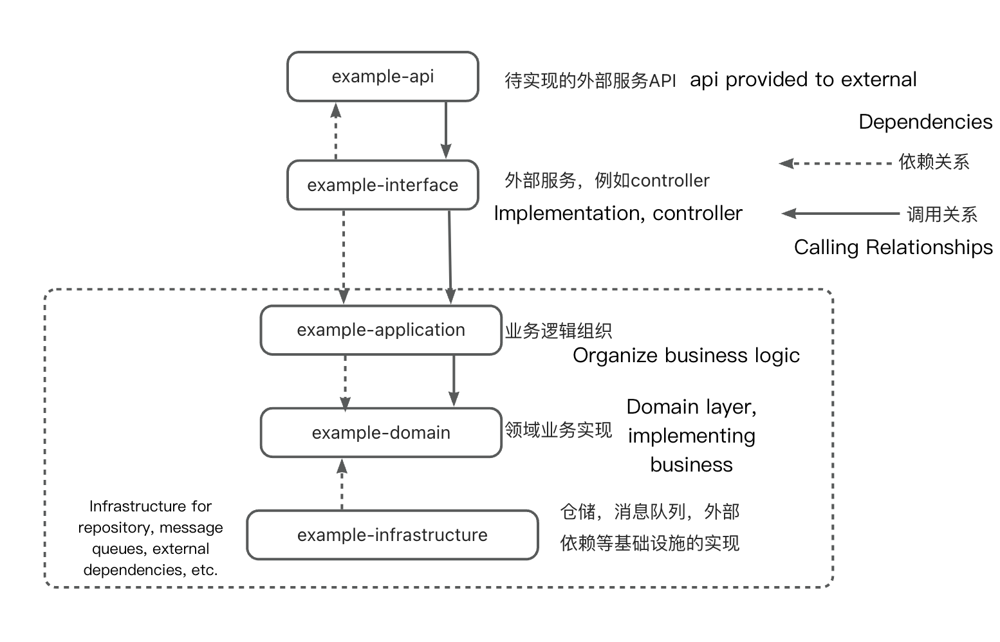

# springboot+cucumber实践

## why BDD

- **Achieve business objectives."**
- **Focus on user needs"**
- **Good readability**

Actually, there are other reasons for me as well:

1. Due to objective reasons, sometimes I only receive the PRD (Product Requirements Document) after the project development is completed. Therefore, in the early stages of development, it is easier to identify issues by establishing clear business processes through certain means rather than diving directly into development. Compared to traditional documentation (DD documents), BDD (Behavior-Driven Development) features may be easier for non-developers to understand.
2. Documentation tends to lag behind, but it helps me or other colleagues who take over the project in the future to quickly review or understand the requirements of a particular business.

<!-- more -->

## Sample Project Start

#### Project stratification:



#### Code:

Take **functional configuration** single upline operation as an example

There is a go live interface in the application

```java
class interface ConfigurationCmdService{
    /**
     * online
     *
     * @param cmd
     * @return
     */
    Result<Boolean>  online(ConfigOnlineCmd cmd);
}
/**
* The interface needs to implement the on-line function
* Assume that the operation requires only 3 steps:
* 1. Find out the configuration that needs to go live
* 2. Go live operation
* 3. Update the db
*/
class class ConfigurationCmdServiceImpl implements ConfigurationCmdService{
	    
    private final ConfigRepository    repository;


    private final ConfigFactory factory;

    public ConfigurationCmdServiceImpl(ConfigRepository repository,ConfigFactory factory){
        this.repository = repository;
        this.factory = factory;
    }

    public ManualQueryServiceImpl(SnapshotRepository repository, ManualSnapshotFactory factory) {
        this.repository = repository;
        this.factory = factory;
    }
    @AutoWired
    Result<Boolean>  online(ConfigOnlineCmd cmd){
        Config config = repository.queryById(cmd.getId());
        config.online();
        //可能还有其他的一些操作
        return repository.update(config);
    }
}
```

## BDD access

### Preliminary work

#### cucumber dependency

```xml
<!-- bdd dependency -->
<dependency>
  <groupId>io.cucumber</groupId>
  <artifactId>cucumber-core</artifactId>
</dependency>
<dependency>
  <groupId>io.cucumber</groupId>
  <artifactId>cucumber-java</artifactId>
</dependency>
<dependency>
  <groupId>io.cucumber</groupId>
  <artifactId>cucumber-junit</artifactId>
  <scope>test</scope>
</dependency>
<dependency>
  <groupId>io.cucumber</groupId>
  <artifactId>cucumber-spring</artifactId>
</dependency>
```

#### Combined with junit4

```xml
<plugin>
                <groupId>org.apache.maven.plugins</groupId>
                <artifactId>maven-surefire-plugin</artifactId>
                <version>${maven-surefire-plugin.version}</version>
                <configuration>
                    <includes>
                        com.example.**Test.java
                    </includes>
                    <testFailureIgnore>false</testFailureIgnore>
                    <skipTests>false</skipTests>
                </configuration>
                <dependencies>
                    <dependency>
                        <groupId>org.apache.maven.surefire</groupId>
                        <artifactId>surefire-junit4</artifactId>
                        <version>2.22.2</version>
                    </dependency>
                </dependencies>
            </plugin>
```

#### Combine with jacoco to generate single test reports

```xml
<plugin>
  <groupId>org.jacoco</groupId>
  <artifactId>jacoco-maven-plugin</artifactId>
  <version>${jacoco.version}</version>
  <executions>
    <execution>
      <goals>
        <goal>prepare-agent</goal>
      </goals>
    </execution>
    <execution>
      <id>report</id>
      <phase>prepare-package</phase>
      <goals>
        <goal>report</goal>
      </goals>
      <configuration>
        <excludes>
          <!-- -Exclude the toolkit Let's say that the toolkit needs to be excluded-->
          <exclude>com.example.util.*</exclude>
        </excludes>
      </configuration>
    </execution>
  </executions>
</plugin>
```


### First step

Start the class

glue actually tells cucumber to scan the file containing @CucumberContextConfiguration under the corresponding package when it starts

```java
@RunWith(Cucumber.class)
@CucumberOptions(
        features = {"classpath:feature"},
        glue = {"com.example.step"},
        plugin = {"pretty","html:target/html-reports.htm"}
)
public class ApplicationTest {

}
```

Configure the beans that need to be started in the test and some beans that need to be de-mocked,

The init method is triggered before running, and the reset method is shown in step 4

```java
@CucumberContextConfiguration
@SpringBootTest(classes = {
        SpringTestConfig.class,
        MockObjectConfiguration.class
    }
)
public class SpringTest {

    @Autowired
    private List<Resetable> resetables;

    @Before
    public void init(){
        CollectionUtils.emptyIfNull(resetables)
                .stream().forEach(v->v.reset());
    }
}
```


### Step 2

Create a new feature file under classpath:feature

\#language:zh-CN for Chinese language

```feature
Feature:Configured crud operations
  Scenario:Online a configuration
    Given The following configurations exist
        |id  | content| status | bizCode |
        |1	 |xxxxx   | AUDIT  | XXXX    |
        |2	 |xxxxx   | DRAFT  | XXXX    |
    When id is "1" on line
        | languageType | bizCode |
        | zh_CN        | 008     |
    Then The configuration status of id "1" is "On-line"
```

### 第三步

实现上述的功能：

```java
public class ContentStep {

    @Autowired
    private FakeConfigRepositoryImpl       configRepository;

    private String                            result;

    @Autowired
    private ConfigurationCmdService cmdService;

    private final String DEFAULT_CODE = "xxx";

    AssertService contentAssertService = new AssertService<>();

    private static final Map<String,String> codeMap = new HashMap<String,String>(){
        {
            put("上线","ONLINE");
            put("审核","AUDIT");
            put("草稿","DRAFT");
        }
    };

    @Given("The following configurations exist")
    public void The following configurations exist(DataTable dataTable) {
        //Create contents based on dataTable
        List<Config> configs = ConfigTransform.transToConfig(dataTable.entries());
        contentRepository.createAll(configs);
    }

    @Then("The configuration status of id {string} is {string}")
    public void The_configuration_status_of_id_is(String id,String status){
        Config config = configRepository.queryById(id);
        //判断结果
        Assert.assertEquals(config.getStatus(),codeMap.get(status));
    }

    @When("id is {string} on line")
    public void id_is_on_line(String id){
        //Create command
        ContentCreateParam param = createOnlineCmd(id);
        //Get Results
        result = cmdService.online(param).getData().toString();
    }
```

### Step 4

mock db, external services. Take mock db as an example

DB uses a map to mock database operations

The reset operation is used to empty the map, and the map is automatically emptied for each use case.

```java
public class FakeConfigRepositoryImpl implements SearchDataRepository ,Resetable{

    @Getter
    private final Map<String, SearchDataDO> doMap;

    private final ConfigConverter converter;

    public FakeSearchDataRepositoryImpl(SearchDataConverter converter) {
        this.doMap = new HashMap<>();
        this.converter = converter;
    }

    /**
     * Create Data
     *
     * @param config
     * @return
     */
    @Override
    public boolean create(Config config) {
        ConfigDO configDo = converter.convert2DO(config);
        doMap.put(String.valueOf(config.getId()),configDo);
        return true;
    }

    /**
     * update
     *
     * @param searchData
     * @return
     */
    @Override
    public boolean update(Config config) {
        create(searchData);
        return true;
    }

    @Override
    public void reset() {
        doMap.clear();
    }
```

**spring-test and spring-context versions must be the same, otherwise it will report an error**

