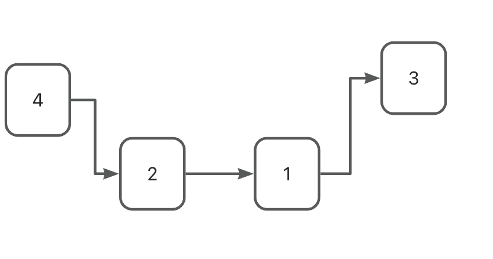
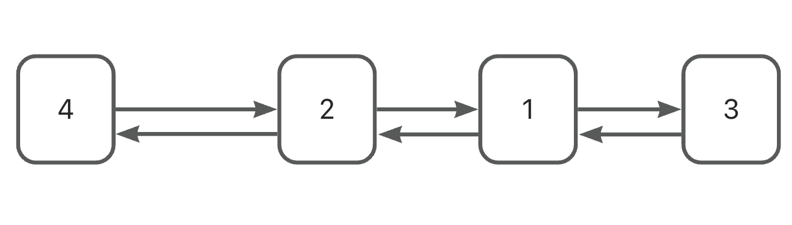
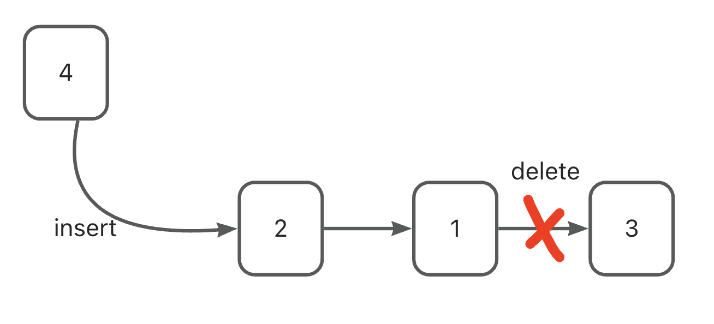
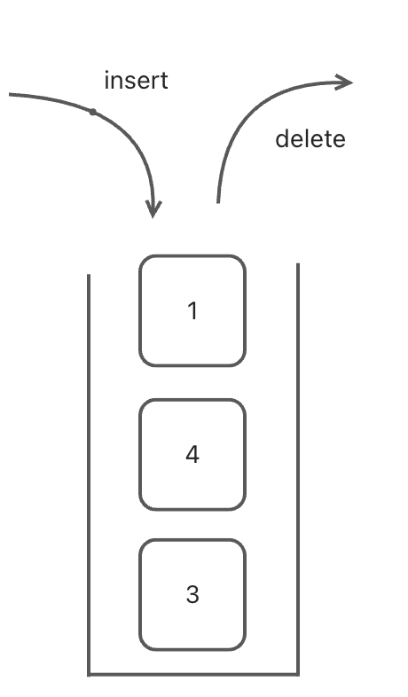

### Preface

Link tables, queues, and stacks are some of the most basic data structures, and link tables are the most basic. Most of the complex data structures that follow evolved from them.

### Linked list

A threaded data structure that differs from an array in that it is not necessarily stored sequentially in memory space. To ensure the continuity of elements in a linked list, a pointer is generally used to find the next element.



<!-- more -->

To implement a linked list of tables using java, you first need to define a node

```java
class Node<T> {
        T       value;
        Node<T> next;

        public Node(T value) {
            this.value = value;
        }
    }
```

Therefore, for a linked list, if you want to find an element based on the index, you can only start from the beginning with time complexity O(N).

If a predecessor node is added to the Node, then it becomes a bi-directional linked list.



The LinkedList in Java is a typical two-way linked list.

If you combine HashMap(Set) on LinkedList, it is **LinkedHashMap**(Set), which ensures the orderliness of the elements and allows O1 to get the elements.

A simple implementation of a linked list is as follows

```java
// Singly linked list
// The head node does not store elements
// Need to record the head node, content is null; record the length of the list
public class LinkList<T> implements Iterable<T>{
    private Node head; // head node
    private int N; // length of the list
    public class Node<T> {
        T item; // store element
        Node next; // point to the next node, a Node object
        public Node(T item, Node next){ // constructor with arguments
            this.item = item;
            this.next = next;
        }
    }
    public LinkList(){ // constructor with no arguments
        this.head = new Node(null,null);
        this.N = 0;
    }
    public void clear(){ // clear the list: head node does not point to the next element
        N=0;
        head.next = null;
    }
    public  boolean isEmpty(){ // check if the list is empty
        return N==0;
    }
    public int length(){ // get the length of the list
        return N;
    }
    public T get(int i){ // get the i-th element
        // Use loop, traverse from the head node, find i times
        Node n = head.next;
        for (int index =0;index <i;index++){
            n = n.next; // loop to point to the next node
        }
        return (T) n.item;
    }
    public void insert(T t){ // insert data
                             // adding elements only requires the last node to point to the new node
        Node n = head;
        while(n.next!=null){
            n = n.next; // tail node cannot be null
        }
        Node newNode = new Node(t,null);
        n.next =newNode;
        N++;
    }
    public void insert(int i,T t){ // insert data before i
                                   // find the node before i
        Node pre = head;
        for (int index = 0;index<=i-1;index++){ // because the head node actually loops i-1 times
            pre = pre.next;
        }
                                   // find the i node
        Node curr = pre.next;
        // create a new node and point to i
        Node newNode = new Node(t,curr);
        // node before i points to the new node
        pre.next = newNode;
        // increment by 1
        N++;
    }
    public T remove (int i){ // remove the i-th element and return it
        // get the node before i
        Node pre = head;
        for (int index = 0;index<=i-1;index++){
            pre = pre.next;
        }
        // find i
        Node curr = pre.next;
        // find the node after i
        Node fur = curr.next;
        // connect the two and decrement by 1
        pre.next = fur;
        N--;
        return (T) curr.item;

    }
    public int indexOf(T t){ // return the first occurrence of the element
        // start iterating from the head node, find every node's element, take out item and compare with T
        Node n = head;
        for (int i =0;n.next!=null;i++){ // keep finding as long as the next element is not null
            n = n.next;
            if (n.item.equals(t)){
                return i;
            } // no alert has been set for elements that do not exist
        }
        return -1;
    }
    public void reverse(){  //Flipping single linked list; Recursive flipping
        if (isEmpty()){
            return;
        }
        else{
            reverse(head.next);
        }
    }
    public Node reverse(Node curr){ //flip the single-linked cur, and return
        if(curr.next==null){
            head.next = curr;
            return curr;
        }
        //recursively reverse the next node of the current node
        Node per = reverse(curr.next); // the new node is the next node after the flip
        per.next = curr; //the next node of the new node is the previous node before reversal
        curr.next = null; //this node is set as the tail node
        return curr;
            //not the last node then recursively flip the node before the last node
    }

Translated with www.DeepL.com/Translator (free version)

    @Override
    public Iterator iterator() {

        return new LIterator();
    }
    private class LIterator implements Iterator {
        private node n;
        public LIterator(){
            this.n = head; //// initialize
        }
        @Override
        public boolean hasNext() { //execute next continuously if the hasNext condition is met
            return n.next!=null;
        }

        @Override
        public Object next() {
            n = n.next;
            return n.item;
        }
    }
}

```

#### 	Algorithm problems, the linked table often appear, the more basic types of questions include: the flip of the chain table, ring judgment, ring entry, multi-linked table to find the Kth big/smallest element, etc.. The linked table is also the basis for implementing jump tables.

### Queue/Stack

​	Chained tables and queues are essentially a special type of single-linked table, differing in that they restrict the order of insertion/deletion of elements.

#### Queues:

For a queue, elements enter from one end and exit from the other, that is, the elements that enter first are deleted first, called in English: First In, First Out, abbreviated FIFO.



​	The more classical use of queues is in breadth-first search (hierarchical traversal of trees is actually also breadth-first search). In addition, queues can also have order, called priority queues, which have been implemented in java and are called **PriorityQueue**.

#### 		Queue Code：

```java
// FIFO Compared to a stack, one end of a queue goes in and one end goes out.
public class Queue<T> implements Iterable<T> {
    private class Node<T>{
        public T item;
        public Node next;
        public Node(T item,Node next){
            this.item = item;
            this.next = next;
        }
    }
    private Node head;  //head
    private int N;
    private Node last;  //tail
    public Queue(){
        this.head = new Node(null,null);
        this.last = null;
        this.N = 0;
    }
    public boolean isEmpty(){
        return N==0;
    }
    public int size(){
        return N;
    }
    public void enqueue(T t){           //Insert the chain from tail, in order from the first node
        if (last == null){
            last= new Node(t,null);
            head.next = last;
        }
        else{
            Node oldlast = last;
            last = new Node(t,null);
            oldlast.next = last;
        }
        N++;
    }
    public T dequeue(){
        if (isEmpty()){
            return null;            //Header node start deletion
        }
        Node oldeFirst = head.next;
        head.next = oldeFirst.next;
        N--;
        //The delete queue is deleting elements, so it needs to be reset last
        if (isEmpty()){
            last = null;
        }
        return (T)oldeFirst.item;
    }
    @Override
    public Iterator<T> iterator(){
        return new QIterator();
    }
    private class QIterator implements Iterator{
        private Node n;
        public QIterator(){
            this.n = head;
        }
        @Override
        public boolean hasNext() {
            return n.next!=null;
        }

        @Override
        public Object next() {
            n = n.next;
            return (T)n.item;
        }
    }
}


```


#### stacks：

The stack is the opposite, elements from one end into, to be from one end out. That is, first in, last out, called in English: First In, Last Out, or FILO.



​	Stacks are often used in algorithms, such as bracket punctuation matching problems, monotone stack problems, etc. Recursion is also a special use of stacks.

#### 		Stack Code:

```java
public class Stack<T> implements Iterable<T>{

    private class Node<T>{     
        public T item;
        public Node next;
        public Node(T item,Node next){
            this.item =item;
            this.next = next;
        }
    }
    private int N;          //Number of stack elements
    private Node head;      
    public Stack(){
        this.N = N;
        this.head = new Node(null,null);
    }
    public boolean isEmpty(){
        return N==0;
    }
    public int size(){
        return N;
    }
    //insert
    public void push(T t){
        //Find the first node pointed to by the first node
        Node oldNode = head.next;
        //create new node
        Node newNode = new Node(t,null);
        //The first node points to the new node
        head.next = newNode;
        //The new node points to the original first node
        newNode.next = oldNode;
        N++;
    }
    public T pop(){
        //The head node points to the first node
        Node oldFirst = head.next;
        //head.next = oldFirst.next is not safe and needs to be verified
        if (oldFirst==null){
            return null;
        }
        head.next = oldFirst.next;
        N--;
        return (T)oldFirst.item;
    }
    @Override
    public Iterator<T> iterator() {
        return new LIterator();
    }
    private class LIterator implements Iterator{
        private Node n;
        public LIterator(){
            this.n = head;
        }
        @Override
        public boolean hasNext() {
            return n.next!=null;
        }
        @Override
        public Object next() {
            n = n.next;
            return n.item;
        }
    }


}
```

